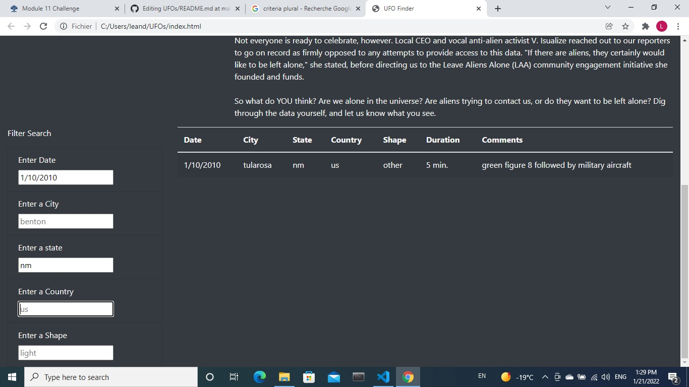

# UFOs

### Overview of the analysis

Dana wants a more in-depth analysis of UFO sightings by allowing users to filter for multiple criteria at the same time on the webpage. 
We added some criteria like city, state, country and shape. 

### Results
The website user can perform a search about UFO sightings based on multiple criteria. As you can see on the image below, the user can search for more than a criterion at the same time. The person enters what they're looking for in the appropriate boxes and then gets the results. 

### Summary

One issue of this webpage is what you write in the searchbox has to match exactly what is in the database. 
This webpage can be improved by successfully matching ufo sightings to what's in the searchbox even if there's a typo.
Another way to improve the website would be to be able to search by intervals. For example, it would be good if the user could search for different UFO sightings between the first ten days of January 2010. 
